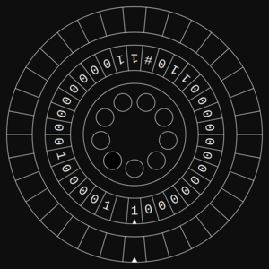
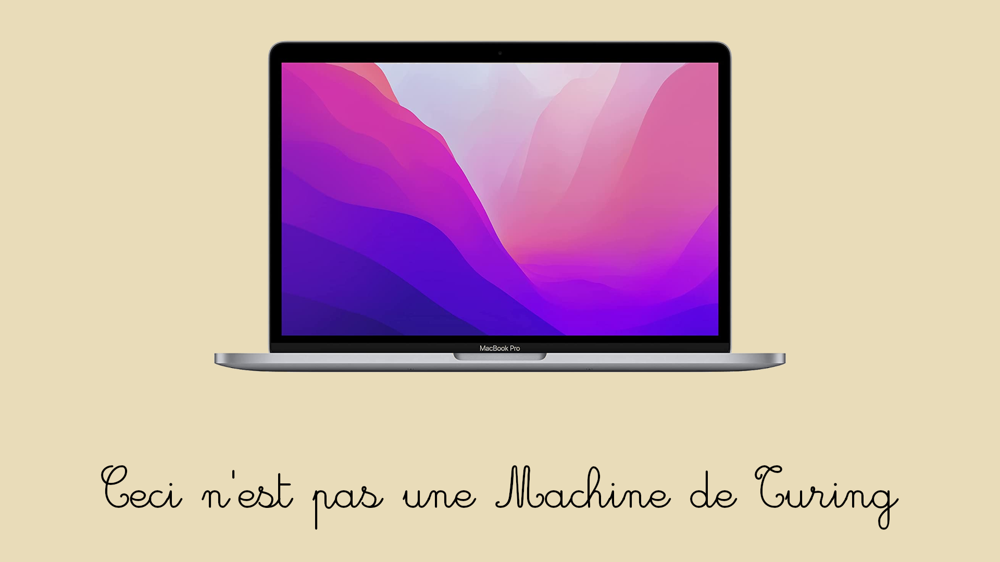

# Turing multiplication

**TL:DR** this is a Turing Machine that multiplies two numbers. Try it out [here]().

One of the first exams that I studied for my Computer Science and Engineering Master's Degree was **Algorithms and Data Structures** *(in Italian, Algoritmi e Principi dell'informatica)*.

It was the first time I had a formal explanation of computer science, complexity classes, and algorithms. I was immediately fascinated by the subject, and I wanted to "dirty my hands" *(as an Italian would say)* and try it out.

And what better way to do it than to implement a Turing Machine? You know, as one does.

Turing Machines are a very interesting concept since they are both a formal and a real model of computation. The first thing that impressed me is their ability to represent any algorithm. How could it be possible? Is it true that with a simple set of transitions, some *(possibly many)* states and a tape, you can represent any algorithm?

Online I quickly found some Turing Machine simulators, but the examples that they provided were quite simple.
Other than adding two numbers, an easy task that can almost be done via an *FSA*, or some "classic" computing examples such as accepting string generated by contextual grammars (the ones generated by the language $L = \left\{ a^n b^n c^n \mid n \geq 1\right\}$), there was nothing really interesting or complex. In the course, we explored many algorithms, but most of the exercises and exams asked *(luckily!)* only to implement natural language-related tasks, such as accepting strings, via Turing Machines.
I wanted to try something more complex and at the same time visually interesting.
That's how I came up with the idea of trying to implement some kind of multiplication algorithm, without looking at any other implementation.

## Some Theory

The invention of the Turing Machine is attributed to English mathematician Alan Turing, who built it in 1936 to attempt to solve the [Entscheidungsproblem](https://en.wikipedia.org/wiki/Decision*problem), which is a fundamental problem in the theory of computation that I won't go into detail here.
Thanks to this invention, Turing was able to crack the German Enigma code during World War II, and he is considered the father of theoretical computer science.

Let's introduce some formality here, shall we?
A Turing Machine is a theoretical model of computation, which is defined by a $9$-tuple:

- A set of **states**, $Q$
  - an **initial** state, $q*0 \in Q$
  - a set of **final** states, $F \subseteq Q$
- An **input** alphabet, $I$
- An **output** alphabet, $O$
- A **memory alphabet**, $\Gamma$
  - an **initial** memory content, $\Z*0 \in \Gamma$
- A **transition function**, $\delta$, defined over the $k$ tapes
  - $\delta: (Q-F) \times I \times \Gamma^k \rightarrow Q \times \Gamma^k \times \left\{\rightarrow, \leftarrow, \downarrow\right\}^{k+1}$
- An **output function** $\eta$
  - $\eta: (Q-F) \times I \times \Gamma^k \rightarrow O \times \left\{\rightarrow, \leftarrow, \downarrow\right\}$

The transition function $\delta$ is the most important part of a Turing Machine since it materially handles the states and the content of the tape; it is defined as a function that takes as input a state, an input symbol and the content of the memory, and returns a new state, a new memory content and a set of directions to move the tapes.

### Choices

Two theorems are fundamental in the creation of a Turing Machine:

- every Turing machine is equal to another at least three states
  - $\Rightarrow$ you will only need three states *(and many symbols)* to represent any Turing Machine
- every Turing machine is equal to another with more than two alphabet symbols
  - $\Rightarrow$ you will only need three symbols *(and many states)* to represent any Turing Machine

Defining the input and output alphabets is not hard: since the numbers will be provided in binary, they will also be outputted in binary. Both $I$ and $O$ will be $\left\{0,1\right\}$.

The memory alphabet, however, needs two more symbols: one for representing the **empty cell** and one for representing the **multiplication number** between the two numbers.
The former will be $\varepsilon$ *(rendered as space in the graphic output for clarity)*, while the latter will be $\#$. It could be any character different from the other two, but I liked them.

#### How many tapes?

The transition function $\delta$ is defined over an arbitrary number of tapes $k$, but how many are really needed? The number of tapes does not affect the computation, but it affects the complexity of the transition function and the number of states.

For graphical reasons, I wanted to have only $2$ tapes: **one for the input** numbers, and **one for the output**.
This made the whole design process a bit more difficult, but it was worth it *(I think)*.

#### This is not a Turing Machine

A real Turing Machine has an infinite tape; this is *obviously* not possible in the real world. Normally, a tape is considered to be infinite if it's reasonably large with respect to the input size.

In my case, the tape size is quite small (only $34$ cells long), not enough to be considered infinite.
This means that the machine falls in the formalism defined by the **Linear Bounded Automaton** *(or LBA)*, which is a subset of the Turing Machine; as a consequence, the computation power is *(theoretically)* smaller.
This machine, due to this constraint, can only multiply two numbers that are a maximum of $16$ bits long (or $2^{16}$, which is $65536$).

## Designing the Turing Machine

Initially, I was using $4$ tapes:

- one for the **first input** number
- one for the **second input** number
- one for the **carry bit**
- one for the **output**

I quickly realised that it was not necessary to keep a separate tape for the carry bit, since it could be (naively) encoded in the output tape.
I gradually managed to reduce the number of tapes to $2$, without any compromise on the functionality:

- the two input numbers are stored in the **same tape**, separated by the $\#$ symbol
- the **carry bit** is encoded by using different states according to the type of sum *(with or without carry)*
- the **output** is stored in its tape

I could have shrunk the number of tapes to $1$, but I found it more graphically pleasing to have the output in a separate tape.
Furthermore, the input tape gets cleaned at the end of the computation; this is not strictly necessary, and generally not even desirable, but I liked it as a visual effect.

### Transition Diagram and states

To shrink the size of the **Transition Diagram** *(which is obscenely large, at about 1700 pixel of width)*, I compacted the transitions that have the same source and destination states, but different input symbols; an alternative in the content of the tapes in a transition is represented by a vertical bar.
Likewise, the new content of the tapes is the same as the old one if the symbols are separated by a vertical bar.

The **Transition Diagram** is the following:

(a more readable version is available [here](static/diagram.pdf)).

The states (and their meaning) are:

- $q_0$: **initial** state, start looking for the end of the input tape
- $q_1$: end found in the input tape
- $q_2$: a $1$ has been found in the input tape
- $q_3$: add the input number to the output tape
- $q_4$: add the carry bit to the output tape`
- $q_5$: rewind output and memory tapes
- $q_6$: rewind output tape until the end
- $q_7$: clean the input tape
- $q_f$: **final** state, computation ended

The meaning of the transitions can be found in the comments of the source code ([in the `automaton.js` file](/js/automaton.js), lines `337` to `378`).

#### Complexity

The time complexity of the computation is $\mathcal{O}\left(n^2\right)$, where $n$ is the number of bits of the input numbers.
This is way worse than the state-of-the-art algorithms for multiplication, which are $\mathcal{O}\left(n \log n\right)$; however, this is not a problem, since the machine is not meant to be used for real-world computations.

The space complexity is $\mathcal{O}\left(n\right)$, hence the result can be computed via an *LBA*.

## Implementation

The whole animation and simulation are implemented in ECMAScript, using [my framework](https://github.com/lorossi/empty-html5-canvas-project) to simplify the use of the Canvas element. It uses [JSzip](https://stuk.github.io/jszip/)](https://stuk.github.io/jszip/) to save each frame, which is then rendered as a video via `FFMPEG`.

Initially, the Turing Machine is initialized to two random numbers, but the user can change them via the input fields and see the result of the computation.

### Graphical Representation

The Turing Machine is represented as a $2$-tapes LBA with $8$ states:

- the **innermost** circle represents the **input** tape
- the **outermost** circle represents the **output** tape
- the small circles represent each of the **states**
  - the active state is **filled in white**

The peculiarity of the machine is that the tapes move while the machine heads stand still; this is achieved by moving the tapes in the opposite direction of the machine head.

The speed can be regulated via the slider, and the computation can be paused and resumed.
By pressing the "compute" button, the machine will reset and start the computation with the numbers provided in the input fields (they must be binary numbers).

When the computation is complete, the input tape is cleaned and the head of the output tape is moved to the first non-empty cell.

### Output

The `output` folder contains two rendered videos of the computation of the product of $2$ random numbers each.
A sample of the output is shown below, but you can find the full videos [here](output).

### In the end

This project was really fun to develop. I completed it about a year ago and then procrastinated on the final bits for way too long.

The hardest part was convincing myself to draw a Transition Diagram since I was not sure I had done everything respecting the various formalisms that I had to study. Implementing a feasible input form for the user has also been a bit tricky, but I managed to do it.

This script can be expanded to implement any other Turing Machine just by changing the transition function and the states; the graphical representation is completely independent from the actual machine *(except for some tweaking in the visible size of the graphical components)*.

I hope you enjoyed reading this as much as I enjoyed writing it!

## Credits

This project is distributed under an MIT license.
